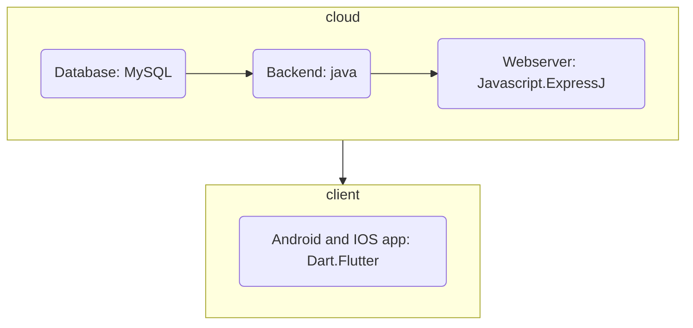

## 1.1 Latar Belakang

Banyaknya orang berdebat tentang hal yg keci

## 1.2. Deksripsi Teknologi Informasi

Game ini mmengguanakan bahasa java

Menggunakan javaFx ini di gunakan untuk pengembangan game juga dan untuk membuat tatap muka antar pengguna

Mengguanakan JDBC((Java Database Connectivity)ini untuk menyimpan dan mengambil data

Di dalam game ini saya juaga menggunakan class java util ini di gunakan untuk angka-angka di dalam game

Dalam pengembangan game yg 2 dimensi saya menggunakan LibGDX

## 1.3. Branding

.Merk:Game Pengundian

.Tagline:aman,terpercaya,dan sangat membantu

.Campaign:permaslahn dapat di selaisaikan dengan bijak,aman,dan simpel

.Target usia:

siswa dan siswi

mahasiswa

masyarakat

pemerintahan

bahkan presiden

.user experience theme:

mudah

sederhana

asik

inspirasi desain


## 2. User Story

Sebagai | Saya ingin bisa | Sehingga | Prioritas
---|---|---|---
Admin| menyediakan kupon sebanyaknya | pesertanya lebih banyak | ⭐⭐⭐⭐⭐
Admin|membuat aturan|gamenya lancar|⭐⭐⭐⭐⭐
admin|menyedikan hadiah yg menarik|pemenang bisa senang|⭐⭐⭐⭐
admin|memberikan tata tertib dahulu|peserta tidak kebingungan|⭐⭐⭐⭐⭐
peserta|membeli kupon|sehingga saya bisa main game ini|⭐⭐⭐⭐⭐
peserta|mengajak orang main juga|admin memberikan plus ke peserta|⭐⭐⭐
Peserta|memasukkan uang ke admin|bisa bermain tanpa ada iklan|⭐⭐⭐⭐
Admin|mengajak peserta melihat pemenang|pemenangnya terhibur|⭐⭐⭐
Admin|membuat kolom saran|peserta dapat menulis kritikan|⭐⭐⭐⭐
peserta|mengajukan permasalahan|admin dan peserta lain dapat menyelesaikannya|⭐⭐⭐⭐⭐
## 3. Struktur Data

Cara membuat aneka macam bentuk grafik menggunakan mermaid.js bisa lihat di [https://mermaid.js.org/syntax/entityRelationshipDiagram.html](https://mermaid.js.org/syntax/entityRelationshipDiagram.html) 


```mermaid
erDiagram
    Peserta|--o{ Peserta : Kupon
    Undian||--|{ Peserta : Kupon
```


## 4. Arsitektur Sistem



## 5. Teknologi, Library, dan Framework

tehnologi yg sya gunkana antara lain:bahasa java,javaFX,JDBC,LibGX.

librarynya : scanner dan lain - lain.

Framework : visul code dan lain- lain.

## 6. Desain User Experience dan User Interface

Bisa load image 

## 7. Demonstrasi Video

Link youtube nya

## 8. Bagaimana mesin komputasi dan sistem operasi berperan dalam produk teknologi informasimu ?

Link youtube nya di detik jawaban ini

## 9. Bagaimana algoritma, struktur data, dan bahasa pemrograman berperan dalam produk teknologi informasimu ?

Link youtube nya di detik jawaban ini

## 10. Bagaimana metode pengembangan perangkat lunak / Software Development Life Cycle berperan dalam produk teknologi informasimu ?

Link youtube nya di detik jawaban ini

## 11. Bagaimana database / sistem basis data berperan dalam produk teknologi informasimu ?

Link youtube nya di detik jawaban ini
