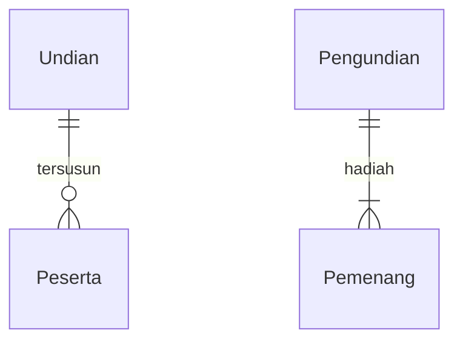
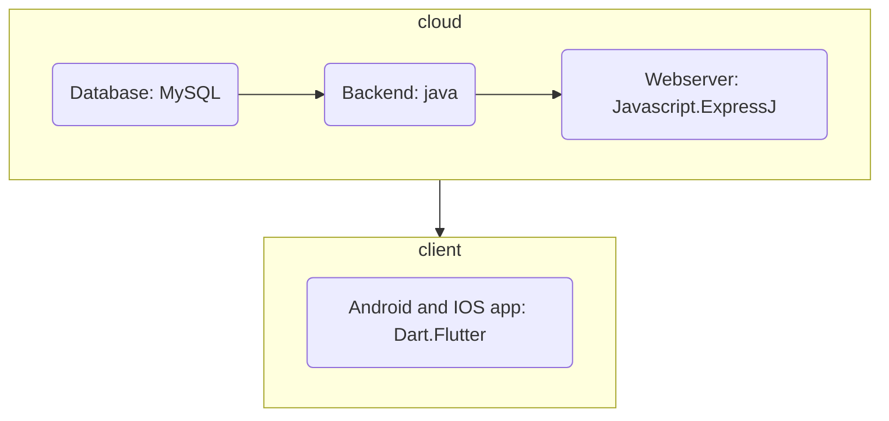

## 1.1 Latar Belakang

setiap  pagi hari kami ke kampus ber sama - sama dengan jalan kaki lewat jalan belakang,
pada suatu hari kami semua bangunnya agaka telat dan buru ke kampus dengan naik angkot ,
pas mau naik angkot kita semua berdebat tentang siapa yg mau bayar angkotnya,semenjak itu 
saya berfikir untuk membuat game in

## 1.2. Deksripsi Teknologi Informasi

game ini mmengguanakan bahasa java,menggunakan javaFx ini di gunakan untuk pengembangan game juga untuk membuat tatap muaka antar pengguna,mengguanakan JDBC((Java Database Connectivity)ini untuk menyimpan dan mengambil data,di dalam game ini sya juaga menngunakan class java util ini di gunakan untuk anka-angka di dalam game,dalam pengembangan game yg 2 dimensi saya menggunakan LibGDX

## 1.3. Branding

.Merk:Game Pengundian

.Tagline:aman,terpercaya,dan sangat membantu

.Campaign:permaslahn dapat di selaisaikan dengan bijak,aman,dan simpel

.Target usia:

siswa dan siswi
mahasiswa
masyarakat
pemerintahan 
bahkan presiden
.user experience theme:
mudah 
sederhana
asik
inspirasi desain

## 2. User Story

Sebagai | Saya ingin bisa | Sehingga | Prioritas
---|---|---|---
Admin| menambah kota peserta | pesertanya lebih banyak | ⭐⭐⭐⭐⭐
peserta|mebeli kupon|ikut serta dalam acara|⭐⭐⭐⭐⭐
admin|menujukkan tempat|pesesrta dapat melihat|⭐⭐⭐⭐
admin|mengendalikan kondis|sehingga acara bisa kondusip|⭐⭐⭐⭐⭐
peserta|menunggu pengondian|dapat melihat pemenangnya|⭐⭐⭐⭐⭐
pesesrta|

## 3. Struktur Data

Cara membuat aneka macam bentuk grafik menggunakan mermaid.js bisa lihat di [https://mermaid.js.org/syntax/entityRelationshipDiagram.html](https://mermaid.js.org/syntax/entityRelationshipDiagram.html) 

## 4. Arsitektur Sistem

## 5. Teknologi, Library, dan Framework

tehnologi yg sya gunkana antara lain:bahasa java,javaFX,JDBC,LibGX.
librarynya : scanner dan lain - lain.
Framework : visul code dan lain- lain.
## 6. Desain User Experience dan User Interface

Bisa load image 

## 7. Demonstrasi Video

Link youtube nya

## 8. Bagaimana mesin komputasi dan sistem operasi berperan dalam produk teknologi informasimu ?

Link youtube nya di detik jawaban ini

## 9. Bagaimana algoritma, struktur data, dan bahasa pemrograman berperan dalam produk teknologi informasimu ?

Link youtube nya di detik jawaban ini

## 10. Bagaimana metode pengembangan perangkat lunak / Software Development Life Cycle berperan dalam produk teknologi informasimu ?

Link youtube nya di detik jawaban ini

## 11. Bagaimana database / sistem basis data berperan dalam produk teknologi informasimu ?

Link youtube nya di detik jawaban ini
